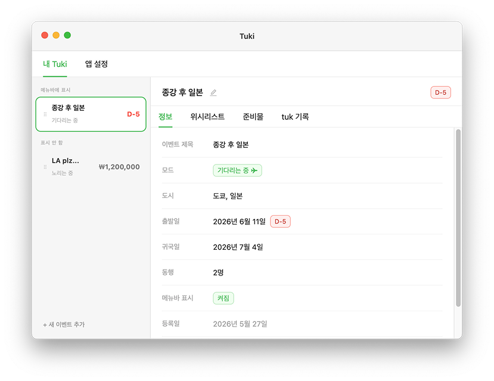
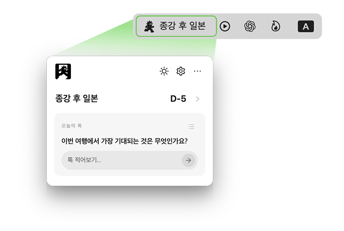

# Tuki Demo

Download the latest macOS demo app from the release below.

- Download: https://github.com/xxykens/tuki-demo-download/releases/download/tuki-demo-v1.0.0/Tuki-1.0.0-arm64.dmg
- SHA-256: `790166e8bc9ff766e595b2263ad498d6443be01a72394920872e246c60c0ff4d`

This is an unsigned demo build. It can be downloaded and installed, but it is not Apple-notarized, so macOS may show:

> Apple could not verify "Tuki" is free of malware.

To open the demo on macOS:

1. Open the DMG and move `Tuki` to `Applications`.
2. In Finder, Control-click or right-click `Tuki`.
3. Choose `Open`, then choose `Open` again.
4. If macOS shows `"Tuki" Not Opened` with only `Done` and `Move to Trash`, choose `Done`.
5. Go to System Settings > Privacy & Security, then allow `Tuki` in the Security section.

If macOS still blocks the app after that, advanced users can remove the download quarantine flag:

```sh
xattr -dr com.apple.quarantine /Applications/Tuki.app
open /Applications/Tuki.app
```

Only open this demo if you downloaded it from this repository.

## About Tuki

Tuki — 메뉴바 여행 트래커

Tuki는 일상 속에서 "곧 떠난다"는 기대감을 꺼지지 않게 유지시켜주는 작은 macOS 메뉴바 여행 트래커 앱입니다. 메뉴바에서 남은 날짜나 목표 항공권 가격을 바로 보고, 앱 안에서는 여행별 위시리스트, 준비물, 오늘의 tuk 기록을 함께 관리합니다.

## Screenshots
Tuki — 설정 화면<br/>


Tuki — 메뉴바 팝오버<br/>


## Features

- 여행별 D-day와 메뉴바 표시 이벤트 관리
- 목적지, 날짜, 동행 인원에 맞춘 준비물 체크
- 위시리스트와 오늘의 tuk 기록으로 여행 아이디어 모으기
- 항공권 목표 가격과 후보 일정 관리
- 여행 날짜가 가까워졌을 때 목적지 날씨 미리보기
